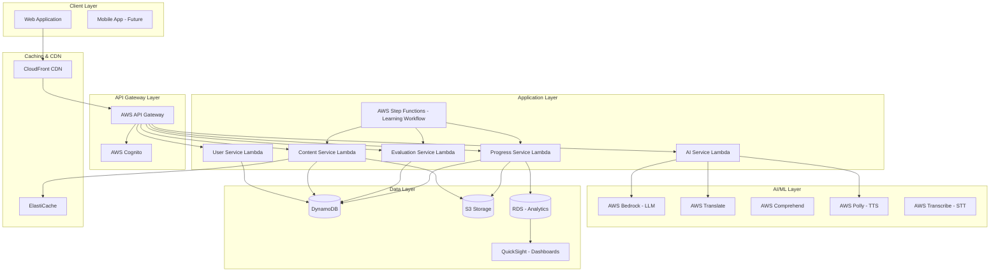

# Design Document: Bharat Tech Tutor

## Overview

Bharat Tech Tutor is a cloud-native, AI-powered multilingual learning platform designed to democratize computer science education for Indian learners. The system addresses the critical gap in technical education accessibility by providing personalized, adaptive learning experiences in multiple Indian languages.

### Core Design Principles

1. **Language-First Architecture**: Multilingual support is not an afterthought but a core architectural component
2. **Adaptive Learning**: Dynamic difficulty adjustment based on real-time performance metrics
3. **Measurable Outcomes**: Comprehensive evaluation framework with multiple scoring dimensions
4. **Scalability**: Cloud-native design supporting millions of learners
5. **Accessibility**: Optimized for low-bandwidth environments common in rural India

### Key Capabilities

- Multilingual content generation and delivery (Hindi, Telugu, Tamil, Kannada, English)
- AI-powered concept explanations with contextual examples
- Line-by-line code analysis and explanation
- Comprehensive evaluation system with four scoring metrics (CMS, LPS, PPS, Retention Score)
- Adaptive difficulty engine that personalizes learning paths
- Interview preparation modules for DSA, DBMS, OS, and SQL
- Progress tracking and analytics with downloadable reports

## Architecture

### High-Level Architecture

The system follows a serverless, event-driven architecture on AWS, designed for scalability, cost-efficiency, and low latency.



### Architecture Rationale

**Serverless Design**: AWS Lambda provides automatic scaling, pay-per-use pricing, and eliminates server management overhead. This is ideal for educational platforms with variable usage patterns (peak during exam seasons, lower during holidays).

**Multi-Database Strategy**:
- **DynamoDB**: Primary operational database for user data, learning sessions, and real-time progress. Chosen for single-digit millisecond latency and seamless scaling.
- **RDS (PostgreSQL)**: Analytics database for complex queries, reporting, and historical analysis. Provides ACID compliance for financial/audit data.
- **S3**: Object storage for learning summaries, generated reports, and static content.

**AI/ML Services**:
- **AWS Bedrock**: Provides access to foundation models (Claude, Llama) for generating explanations and evaluations
- **AWS Translate**: Real-time translation for multilingual content
- **AWS Comprehend**: Natural language understanding for analyzing user responses and text understanding
- **AWS Transcribe**: Voice input support for accessibility (optional future enhancement)
- **AWS Polly**: Text-to-speech for voice output in multiple Indian languages

**Caching Strategy**:
- **CloudFront**: CDN for static assets and API responses, reducing latency for users across India
- **ElastiCache**: Redis-based caching for frequently accessed content (popular concepts, common questions)

**Workflow Orchestration**:
- **AWS Step Functions**: Orchestrates the adaptive learning workflow (explanation → evaluation → scoring → difficulty adjustment)
- Provides visual monitoring of learning session progress
- Handles retries and error recovery for multi-step processes
- Enables complex workflows like retention score calculation and periodic review scheduling

**Analytics and Reporting**:
- **Amazon QuickSight**: Business intelligence dashboards for administrators
- Visualizes user engagement, concept popularity, and learning outcomes
- Provides insights for content improvement and system optimization

## Components and Interfaces

### 1. User Service

**Responsibility**: Manages user authentication, authorization, profile management, and preferences.

**Key Operations**:
- `registerUser(name, email, password, preferredLanguage)`: Creates new user account
- `authenticateUser(email, password)`: Validates credentials and returns JWT token
- `updateUserProfile(userId, profileData)`: Updates user preferences and settings
- `getUserPreferences(userId)`: Retrieves user's language and difficulty preferences

**Data Model**:
```typescript
interface User {
  userId: string;              // UUID
  email: string;               // Unique
  name: string;
  passwordHash: string;        // bcrypt hashed
  preferredLanguage: Language; // enum: HINDI, TELUGU, TAMIL, KANNADA, ENGLISH
  difficultyLevel: DifficultyLevel; // enum: BEGINNER, INTERMEDIATE, ADVANCED
  createdAt: timestamp;
  lastLoginAt: timestamp;
  profileMetadata: {
    educationLevel: string;    // e.g., "Class 10", "Engineering Student"
    learningGoals: string[];   // e.g., ["DSA", "Interview Prep"]
  }
}
```

**AWS Integration**:
- Uses AWS Cognito for authentication and user pool management
- Stores user profiles in DynamoDB with userId as partition key
- Implements JWT-based authorization for API access

### 2. Content Service

**Responsibility**: Generates and delivers multilingual learning content, including concept explanations and code analysis.

**Key Operations**:
- `explainConcept(conceptId, language, difficultyLevel)`: Generates step-by-step concept explanation
- `explainCode(codeSnippet, language, programmingLanguage)`: Provides line-by-line code explanation
- `getInterviewQuestions(topic, difficulty, language)`: Retrieves interview preparation content
- `translateContent(content, targetLanguage)`: Translates content to target language

**Data Model**:
```typescript
interface Concept {
  conceptId: string;
  title: string;
  category: Category;          // enum: DSA, DBMS, OS, SQL, PROGRAMMING
  baseContent: string;         // English base content
  difficulty: DifficultyLevel;
  prerequisites: string[];     // Array of conceptIds
  estimatedTime: number;       // minutes
  tags: string[];
}

interface Explanation {
  explanationId: string;
  conceptId: string;
  language: Language;
  difficulty: DifficultyLevel;
  content: ExplanationBlock[];
  generatedAt: timestamp;
  cachedUntil: timestamp;
}

interface ExplanationBlock {
  blockType: 'text' | 'code' | 'example' | 'analogy';
  content: string;
  order: number;
}
```

**AI Integration**:
- Uses AWS Bedrock (Claude 3) for generating explanations
- Implements prompt engineering for culturally relevant examples
- Uses AWS Translate for real-time translation with technical term preservation
- Caches generated content in ElastiCache with TTL of 24 hours

**Content Generation Strategy**:
1. Check cache for existing explanation (language + difficulty + conceptId)
2. If cache miss, generate using LLM with structured prompt
3. Post-process to ensure technical accuracy and cultural relevance
4. Translate if needed, preserving technical terms
5. Cache result and return to user

### 3. Evaluation Service

**Responsibility**: Assesses user understanding, calculates scoring metrics, and provides feedback.

**Key Operations**:
- `generateEvaluation(conceptId, difficultyLevel, language)`: Creates evaluation questions
- `evaluateResponse(evaluationId, userId, answers)`: Scores user responses
- `calculateCMS(evaluationResult)`: Computes Concept Mastery Score
- `provideFeedback(evaluationResult)`: Generates explanatory feedback for answers

**Data Model**:
```typescript
interface Evaluation {
  evaluationId: string;
  conceptId: string;
  questions: Question[];
  difficulty: DifficultyLevel;
  language: Language;
  totalPoints: number;
}

interface Question {
  questionId: string;
  questionText: string;
  questionType: 'MCQ' | 'SHORT_ANSWER' | 'CODE';
  options?: string[];          // For MCQ
  correctAnswer: string;
  explanation: string;         // Why this answer is correct
  points: number;
}

interface EvaluationResult {
  resultId: string;
  evaluationId: string;
  userId: string;
  conceptId: string;
  answers: UserAnswer[];
  score: number;               // Raw score
  cms: number;                 // Concept Mastery Score (0-100)
  feedback: Feedback[];
  completedAt: timestamp;
}

interface UserAnswer {
  questionId: string;
  userResponse: string;
  isCorrect: boolean;
  pointsEarned: number;
}

interface Feedback {
  questionId: string;
  correctAnswer: string;
  explanation: string;
  userAnswer: string;
  isCorrect: boolean;
}
```

**Evaluation Logic**:
- Generates 5-10 questions per concept based on difficulty
- Uses AI to create questions that test understanding, not memorization
- Implements partial credit for code questions
- Provides detailed explanations for both correct and incorrect answers

### 4. Progress Service

**Responsibility**: Tracks learning progress, calculates aggregate scores, and generates reports.

**Key Operations**:
- `recordLearningSession(userId, conceptId, evaluationResult)`: Logs completed session
- `calculateLPS(userId)`: Computes Learning Progress Score
- `calculatePPS(userId, practiceResults)`: Computes Practice Performance Score
- `calculateRetentionScore(userId, conceptId)`: Measures knowledge retention
- `generateLearningSummary(userId, dateRange)`: Creates downloadable report

**Data Model**:
```typescript
interface LearningSession {
  sessionId: string;
  userId: string;
  conceptId: string;
  startTime: timestamp;
  endTime: timestamp;
  evaluationResult: EvaluationResult;
  difficultyLevel: DifficultyLevel;
}

interface ProgressMetrics {
  userId: string;
  lps: number;                 // Learning Progress Score (0-100)
  pps: number;                 // Practice Performance Score (0-100)
  conceptScores: Map<string, ConceptScore>;
  lastUpdated: timestamp;
}

interface ConceptScore {
  conceptId: string;
  cms: number;                 // Current Concept Mastery Score
  highestCMS: number;          // Best score achieved
  attemptsCount: number;
  lastAttemptDate: timestamp;
  retentionScore?: number;     // If re-evaluated after 7+ days
  retentionCheckDate?: timestamp;
}

interface LearningSummary {
  summaryId: string;
  userId: string;
  generatedAt: timestamp;
  dateRange: { start: timestamp; end: timestamp };
  overallMetrics: {
    lps: number;
    pps: number;
    totalConcepts: number;
    masteredConcepts: number;  // CMS >= 70%
  };
  conceptBreakdown: ConceptScore[];
  recommendations: string[];
  pdfUrl: string;              // S3 URL
}
```

**Score Calculation Algorithms**:

**CMS (Concept Mastery Score)**:
```
CMS = (pointsEarned / totalPoints) × 100
```

**LPS (Learning Progress Score)**:
```
LPS = (Σ CMS for all completed concepts) / (number of completed concepts)
```

**PPS (Practice Performance Score)**:
```
PPS = weighted_average(
  correctness: 50%,
  code_quality: 30%,
  time_complexity: 20%
)
```

**Retention Score**:
```
RetentionScore = (current_CMS / initial_CMS) × 100
Measured when user re-evaluates after 7+ days
```

### 5. Adaptive Difficulty Engine

**Responsibility**: Dynamically adjusts content difficulty based on user performance.

**Key Operations**:
- `evaluatePerformanceTrend(userId)`: Analyzes recent performance
- `adjustDifficulty(userId, currentLevel)`: Updates difficulty level
- `logDifficultyChange(userId, oldLevel, newLevel, reason)`: Audits adjustments

**Adjustment Logic**:
```typescript
interface PerformanceTrend {
  recentCMSScores: number[];   // Last 5 evaluations
  averageCMS: number;
  consistency: number;         // Standard deviation
}

function adjustDifficulty(userId: string, trend: PerformanceTrend): DifficultyLevel {
  const avgCMS = trend.averageCMS;
  const currentLevel = getUserDifficultyLevel(userId);
  
  // Increase difficulty if consistently high performance
  if (avgCMS >= 80 && trend.consistency < 10) {
    if (currentLevel === 'BEGINNER') return 'INTERMEDIATE';
    if (currentLevel === 'INTERMEDIATE') return 'ADVANCED';
  }
  
  // Decrease difficulty if struggling
  if (avgCMS < 50 && trend.recentCMSScores.length >= 3) {
    if (currentLevel === 'ADVANCED') return 'INTERMEDIATE';
    if (currentLevel === 'INTERMEDIATE') return 'BEGINNER';
  }
  
  return currentLevel; // No change
}
```

**Audit Trail**:
- All difficulty adjustments logged to DynamoDB
- Includes: userId, timestamp, old level, new level, trigger reason, performance metrics
- Used for ML model training and system improvement

### 6. AI Service

**Responsibility**: Abstracts AI/ML operations and provides unified interface for content generation.

**Key Operations**:
- `generateExplanation(concept, language, difficulty)`: Creates concept explanation
- `generateQuestions(concept, difficulty, count)`: Creates evaluation questions
- `analyzeCode(code, language)`: Provides code analysis and explanation
- `translateWithContext(text, targetLanguage, technicalTerms)`: Context-aware translation

**AI Model Abstraction**:
```typescript
interface AIProvider {
  generateText(prompt: string, parameters: GenerationParams): Promise<string>;
  analyzeText(text: string): Promise<Analysis>;
}

class BedrockProvider implements AIProvider {
  modelId: string = 'anthropic.claude-3-sonnet-20240229-v1:0';
  
  async generateText(prompt: string, params: GenerationParams): Promise<string> {
    // AWS Bedrock API call
  }
}

// Future: Can add OpenAI, Gemini, or custom models
class OpenAIProvider implements AIProvider { ... }
```

**Prompt Engineering**:
- Structured prompts with role, context, and constraints
- Includes examples of desired output format
- Specifies cultural context (Indian examples, relatable analogies)
- Enforces technical accuracy and simplicity

**Example Prompt Template**:
```
Role: You are an expert computer science tutor for Indian students.

Context: Explain the concept of "{conceptName}" to a {difficultyLevel} learner in {language}.

Constraints:
- Use simple, step-by-step explanations
- Include examples relevant to Indian context
- Avoid jargon unless necessary (then explain it)
- Use analogies from everyday life
- Keep technical terms in English with translations

Format:
1. Simple definition
2. Why it matters
3. Step-by-step explanation
4. Real-world example
5. Common mistakes to avoid
```

## Data Models

### Database Schema Design

**DynamoDB Tables**:

**1. Users Table**
- Partition Key: `userId` (String)
- Attributes: email, name, passwordHash, preferredLanguage, difficultyLevel, createdAt, lastLoginAt, profileMetadata
- GSI: email-index (for login lookups)

**2. Concepts Table**
- Partition Key: `conceptId` (String)
- Attributes: title, category, baseContent, difficulty, prerequisites, estimatedTime, tags
- GSI: category-difficulty-index (for filtering concepts)

**3. LearningSessionsTable**
- Partition Key: `userId` (String)
- Sort Key: `sessionId` (String, timestamp-based)
- Attributes: conceptId, startTime, endTime, evaluationResult, difficultyLevel
- GSI: conceptId-index (for concept analytics)

**4. ProgressMetrics Table**
- Partition Key: `userId` (String)
- Attributes: lps, pps, conceptScores (Map), lastUpdated
- Updated after each learning session

**5. DifficultyAuditLog Table**
- Partition Key: `userId` (String)
- Sort Key: `timestamp` (Number)
- Attributes: oldLevel, newLevel, reason, performanceMetrics
- TTL: 90 days (for compliance)

**RDS Schema (PostgreSQL)** - For Analytics:

```sql
-- Aggregated analytics table
CREATE TABLE user_analytics (
  user_id UUID PRIMARY KEY,
  total_sessions INTEGER,
  total_concepts_completed INTEGER,
  average_lps DECIMAL(5,2),
  average_pps DECIMAL(5,2),
  last_active_date TIMESTAMP,
  created_at TIMESTAMP,
  updated_at TIMESTAMP
);

-- Concept popularity and effectiveness
CREATE TABLE concept_analytics (
  concept_id VARCHAR(100) PRIMARY KEY,
  total_attempts INTEGER,
  average_cms DECIMAL(5,2),
  average_completion_time INTEGER, -- minutes
  success_rate DECIMAL(5,2), -- % scoring >= 70
  updated_at TIMESTAMP
);

-- Daily active users and engagement
CREATE TABLE daily_metrics (
  metric_date DATE PRIMARY KEY,
  active_users INTEGER,
  new_registrations INTEGER,
  total_sessions INTEGER,
  average_session_duration INTEGER,
  created_at TIMESTAMP
);
```

### Data Flow Patterns

**Learning Session Flow**:
1. User requests concept explanation → Content Service
2. Content Service checks cache → ElastiCache
3. If miss, generate via AI Service → AWS Bedrock
4. Cache and return explanation
5. User completes learning → requests evaluation
6. Evaluation Service generates questions → AI Service
7. User submits answers → Evaluation Service scores
8. Results stored → Progress Service updates metrics
9. Adaptive Engine checks if difficulty adjustment needed
10. All data persisted to DynamoDB

**Progress Calculation Flow**:
1. New evaluation result received
2. Update ConceptScore in ProgressMetrics table
3. Recalculate LPS (average of all CMS scores)
4. Check if retention evaluation is due (7+ days since last attempt)
5. Trigger difficulty adjustment check
6. Update user dashboard data

## Correctness Properties

*A property is a characteristic or behavior that should hold true across all valid executions of a system—essentially, a formal statement about what the system should do. Properties serve as the bridge between human-readable specifications and machine-verifiable correctness guarantees.*


### User Authentication Properties

**Property 1: Valid registration creates account**
*For any* valid user registration data (name, email, password, preferred language), creating an account should succeed and the account should be retrievable with all provided attributes.
**Validates: Requirements 1.1**

**Property 2: Valid credentials authenticate successfully**
*For any* registered user with valid credentials, authentication should succeed and return a valid JWT token.
**Validates: Requirements 1.2**

**Property 3: Invalid credentials are rejected**
*For any* invalid credential combination (wrong password, non-existent email, malformed input), authentication should fail and return an appropriate error message.
**Validates: Requirements 1.3**

**Property 4: User preferences round-trip**
*For any* user and any valid preference values (language, difficulty level), updating preferences then retrieving them should return the updated values.
**Validates: Requirements 1.4, 1.5**

### Multilingual Content Properties

**Property 5: All supported languages deliver content**
*For any* concept and any supported language (Hindi, Telugu, Tamil, Kannada, English), requesting an explanation should return content in that language.
**Validates: Requirements 2.1, 2.2, 2.3**

**Property 6: Language switching updates subsequent content**
*For any* user in a learning session, switching from language A to language B should result in all subsequent content being delivered in language B.
**Validates: Requirements 2.4**

**Property 7: Technical terms include English equivalents**
*For any* translated content in a non-English language, all technical terms should appear with their English equivalents in parentheses.
**Validates: Requirements 2.5**

### Concept Explanation Properties

**Property 8: Explanations contain logical steps**
*For any* concept explanation, the content should be structured as multiple ordered steps (at least 2 steps).
**Validates: Requirements 3.1**

**Property 9: Algorithm explanations include code or diagrams**
*For any* algorithm concept, the explanation should contain either pseudocode blocks or visual representations.
**Validates: Requirements 3.3**

**Property 10: Explanation complexity adapts to difficulty**
*For any* concept, explanations generated at BEGINNER difficulty should be measurably simpler (shorter sentences, fewer technical terms) than explanations at ADVANCED difficulty.
**Validates: Requirements 3.4**

### Code Explanation Properties

**Property 11: Code is parsed into logical blocks**
*For any* valid code snippet, the system should parse it into one or more logical blocks (functions, loops, conditionals).
**Validates: Requirements 4.1**

**Property 12: Line-by-line explanations in preferred language**
*For any* code snippet with N lines and user preferred language L, the explanation should contain N explanations in language L.
**Validates: Requirements 4.2**

**Property 13: Code explanations highlight key elements**
*For any* code explanation, the text should mention variables, control flow structures (if/while/for), and function calls present in the code.
**Validates: Requirements 4.3**

**Property 14: Code errors are identified**
*For any* code snippet containing syntax or logical errors, the system should identify and explain at least one error.
**Validates: Requirements 4.5**

### Interview Preparation Properties

**Property 15: All interview topics provide content**
*For any* interview topic (DSA, DBMS, OS, SQL), requesting questions should return at least one question with a solution.
**Validates: Requirements 5.1, 5.2, 5.3, 5.4**

**Property 16: Interview questions ordered by difficulty**
*For any* interview topic, the returned questions should be ordered such that difficulty is non-decreasing (BEGINNER ≤ INTERMEDIATE ≤ ADVANCED).
**Validates: Requirements 5.5**

**Property 17: Interview questions have solutions**
*For any* interview question, there should exist a corresponding detailed solution and explanation.
**Validates: Requirements 5.6**

### Evaluation Properties

**Property 18: Evaluations generated for concepts**
*For any* concept, requesting an evaluation should return at least 3 questions.
**Validates: Requirements 6.1**

**Property 19: Evaluation provides feedback**
*For any* submitted evaluation with answers, the response should include feedback for each question.
**Validates: Requirements 6.3**

**Property 20: CMS calculated from evaluation**
*For any* evaluation result, the CMS should be calculated and included in the response.
**Validates: Requirements 6.4**

**Property 21: Feedback explains correctness**
*For any* evaluated answer, the feedback should include an explanation of why the answer was correct or incorrect.
**Validates: Requirements 6.6**

### Score Calculation Properties

**Property 22: CMS formula correctness**
*For any* evaluation with P points earned and T total points, the CMS should equal (P / T) × 100.
**Validates: Requirements 7.1**

**Property 23: CMS persisted per concept**
*For any* completed evaluation for concept C, storing the result then retrieving scores for concept C should return the CMS.
**Validates: Requirements 7.2**

**Property 24: Highest CMS retained on retake**
*For any* concept with multiple evaluation attempts, the stored CMS should be the maximum score achieved across all attempts.
**Validates: Requirements 7.4**

**Property 25: CMS categorization**
*For any* CMS value V:
- If 0 ≤ V ≤ 40, category should be BEGINNER
- If 41 ≤ V ≤ 70, category should be INTERMEDIATE  
- If 71 ≤ V ≤ 100, category should be ADVANCED
**Validates: Requirements 7.5**

**Property 26: LPS calculation correctness**
*For any* user with N completed concepts having CMS values [C1, C2, ..., CN], the LPS should equal (C1 + C2 + ... + CN) / N.
**Validates: Requirements 8.1**

**Property 27: LPS updates on new evaluation**
*For any* user with initial LPS value L1, completing a new concept evaluation should result in a different LPS value L2 (unless the new CMS exactly equals L1).
**Validates: Requirements 8.2**

**Property 28: LPS tracked over time**
*For any* user with multiple evaluations over time, the system should maintain a history of LPS values with timestamps.
**Validates: Requirements 8.4**

**Property 29: LPS calculated per category**
*For any* user with evaluations in multiple categories (DSA, DBMS, OS, SQL), the system should calculate and store separate LPS values for each category.
**Validates: Requirements 8.5**

**Property 30: PPS calculation includes all factors**
*For any* practice problem solution, the PPS should be calculated using correctness (50%), code quality (30%), and time complexity (20%) weights.
**Validates: Requirements 9.2**

**Property 31: PPS tracked over time**
*For any* user with multiple practice attempts, the system should maintain a history of PPS values with timestamps.
**Validates: Requirements 9.4**

**Property 32: Retention score formula correctness**
*For any* concept with initial CMS = I and current re-evaluation CMS = C (after 7+ days), the Retention_Score should equal (C / I) × 100.
**Validates: Requirements 10.2**

### Adaptive Difficulty Properties

**Property 33: High performance increases difficulty**
*For any* user with 5 consecutive CMS scores all ≥ 80% at BEGINNER level, the difficulty should increase to INTERMEDIATE.
**Validates: Requirements 11.1**

**Property 34: Low performance decreases difficulty**
*For any* user with 3 consecutive CMS scores all < 50% at ADVANCED level, the difficulty should decrease to INTERMEDIATE.
**Validates: Requirements 11.2**

**Property 35: Content adapts to difficulty level**
*For any* concept and difficulty level, the generated content (explanations and questions) should reflect the specified difficulty level.
**Validates: Requirements 11.3, 11.4**

**Property 36: Difficulty changes trigger notifications**
*For any* difficulty level change from L1 to L2, a notification should be generated for the user.
**Validates: Requirements 11.5**

**Property 37: Difficulty adjustments are logged**
*For any* difficulty level change, an audit log entry should be created with userId, timestamp, old level, new level, and reason.
**Validates: Requirements 11.6**

### Data Persistence Properties

**Property 38: Learning session round-trip**
*For any* completed learning session, persisting the session data then retrieving it should return all session attributes (conceptId, times, evaluation result, difficulty).
**Validates: Requirements 12.1**

**Property 39: All scores persisted**
*For any* user with completed evaluations, retrieving their progress should return CMS, LPS, PPS, and Retention_Score (if applicable) for each concept.
**Validates: Requirements 12.2**

**Property 40: Progress history retrievable**
*For any* user with learning history, requesting their progress history should return all stored learning sessions and scores.
**Validates: Requirements 12.5**

### Learning Summary Properties

**Property 41: Learning summary generated**
*For any* user with at least one completed concept, requesting a learning summary should return a report.
**Validates: Requirements 13.1**

**Property 42: Learning summary completeness**
*For any* generated learning summary, it should include all evaluation scores (CMS, LPS, PPS, Retention_Score), completed concepts list, mastery levels, and learning trends.
**Validates: Requirements 13.2, 13.3, 13.4**

**Property 43: Learning summary in PDF format**
*For any* generated learning summary, the output should be a valid PDF file that can be downloaded.
**Validates: Requirements 13.5**

### Data Compression Property

**Property 44: Content is compressed**
*For any* text content delivered to clients, the response should be compressed (gzip or brotli encoding).
**Validates: Requirements 15.2**

### Security Properties

**Property 45: Passwords are hashed**
*For any* user registration or password update, the stored password should be hashed (not plain text) and should not be reversible to the original password.
**Validates: Requirements 16.1**

**Property 46: Access control enforced**
*For any* data operation, users should only be able to access their own data, and unauthorized access attempts should be rejected.
**Validates: Requirements 16.4**

**Property 47: Data deletion completeness**
*For any* user requesting data deletion, all personal data (profile, sessions, scores) should be removed from the system.
**Validates: Requirements 16.5**

### AI Model Integration Properties

**Property 48: AI model abstraction works**
*For any* AI operation (explanation generation, question generation), switching between different AI model implementations should not break functionality.
**Validates: Requirements 18.1, 18.2**

**Property 49: AI model backward compatibility**
*For any* new AI model integration, the output format should be compatible with existing system components.
**Validates: Requirements 18.3**

**Property 50: AI metrics logged**
*For any* AI model operation, performance metrics (latency, token count, model version) should be logged.
**Validates: Requirements 18.4**

## Error Handling

### Error Categories

The system implements comprehensive error handling across four categories:

**1. Client Errors (4xx)**
- **400 Bad Request**: Invalid input data (malformed JSON, missing required fields)
- **401 Unauthorized**: Missing or invalid authentication token
- **403 Forbidden**: Valid authentication but insufficient permissions
- **404 Not Found**: Requested resource doesn't exist (concept, user, session)
- **409 Conflict**: Resource already exists (duplicate email registration)
- **429 Too Many Requests**: Rate limit exceeded

**2. Server Errors (5xx)**
- **500 Internal Server Error**: Unexpected application errors
- **502 Bad Gateway**: AI service unavailable or timeout
- **503 Service Unavailable**: System maintenance or overload
- **504 Gateway Timeout**: Request exceeded maximum processing time

**3. AI Service Errors**
- **AI_GENERATION_FAILED**: LLM failed to generate content
- **AI_TRANSLATION_FAILED**: Translation service error
- **AI_TIMEOUT**: AI request exceeded timeout threshold
- **AI_RATE_LIMIT**: AI service rate limit reached

**4. Data Errors**
- **DATA_NOT_FOUND**: Requested data doesn't exist in database
- **DATA_CORRUPTION**: Stored data is invalid or corrupted
- **DATA_CONFLICT**: Concurrent modification conflict
- **STORAGE_FULL**: Storage quota exceeded

### Error Response Format

All errors follow a consistent JSON structure:

```typescript
interface ErrorResponse {
  error: {
    code: string;           // Machine-readable error code
    message: string;        // Human-readable message in user's language
    details?: any;          // Additional context (validation errors, etc.)
    requestId: string;      // For tracking and debugging
    timestamp: number;      // Unix timestamp
  }
}
```

### Error Handling Strategies

**Retry Logic**:
- Transient errors (503, 504, AI timeouts) trigger exponential backoff retry
- Maximum 3 retry attempts with delays: 1s, 2s, 4s
- Circuit breaker pattern for AI services (open after 5 consecutive failures)

**Graceful Degradation**:
- If AI translation fails, fall back to English content
- If cache unavailable, fetch directly from database
- If analytics database down, continue core operations without analytics

**User-Friendly Messages**:
- All error messages translated to user's preferred language
- Technical details logged but not exposed to users
- Actionable guidance provided ("Please try again" vs "Contact support")

**Logging and Monitoring**:
- All errors logged to CloudWatch with full context
- Critical errors trigger alerts (PagerDuty/SNS)
- Error rates tracked per endpoint and error type
- Distributed tracing with AWS X-Ray for debugging

### Validation Rules

**Input Validation**:
- Email: RFC 5322 compliant format
- Password: Minimum 8 characters, at least one uppercase, one lowercase, one number
- Name: 2-100 characters, Unicode letters and spaces allowed
- Language: Must be one of supported languages enum
- ConceptId: UUID v4 format
- Scores: Numeric values between 0-100

**Business Logic Validation**:
- Cannot evaluate concept without completing explanation
- Cannot calculate retention score before 7 days elapsed
- Cannot decrease difficulty below BEGINNER or increase above ADVANCED
- Cannot delete user with active learning session

## Testing Strategy

### Dual Testing Approach

The Bharat Tech Tutor platform requires both unit testing and property-based testing to ensure comprehensive correctness:

**Unit Tests**: Focus on specific examples, edge cases, and error conditions
- Specific user registration scenarios (valid email, invalid email, duplicate email)
- Edge cases like empty input, maximum length strings, special characters
- Error conditions like network failures, database unavailable, AI service timeout
- Integration points between services

**Property-Based Tests**: Verify universal properties across all inputs
- Generate random valid user data and verify registration works
- Generate random CMS scores and verify LPS calculation
- Generate random code snippets and verify parsing
- Test with all supported languages and difficulty levels

### Property-Based Testing Configuration

**Framework**: We will use **fast-check** for TypeScript/JavaScript property-based testing.

**Test Configuration**:
- Minimum 100 iterations per property test (due to randomization)
- Each property test must reference its design document property
- Tag format: `// Feature: bharat-tech-tutor, Property {number}: {property_text}`

**Example Property Test Structure**:
```typescript
import fc from 'fast-check';

// Feature: bharat-tech-tutor, Property 22: CMS formula correctness
test('CMS calculation is correct for any evaluation result', () => {
  fc.assert(
    fc.property(
      fc.integer({ min: 0, max: 100 }), // points earned
      fc.integer({ min: 1, max: 100 }), // total points
      (pointsEarned, totalPoints) => {
        fc.pre(pointsEarned <= totalPoints); // precondition
        
        const cms = calculateCMS(pointsEarned, totalPoints);
        const expected = (pointsEarned / totalPoints) * 100;
        
        expect(cms).toBeCloseTo(expected, 2);
      }
    ),
    { numRuns: 100 }
  );
});
```

### Test Coverage Goals

**Unit Test Coverage**:
- Minimum 80% code coverage for business logic
- 100% coverage for score calculation functions
- 100% coverage for security-critical code (authentication, authorization)

**Property Test Coverage**:
- All 50 correctness properties must have corresponding property tests
- Each property test should cover the full input space for that property
- Edge cases should be explicitly tested in addition to random generation

### Testing Layers

**1. Unit Tests (Jest)**
- Individual function testing
- Mock external dependencies (AWS services, AI models)
- Fast execution (< 5 seconds for full suite)

**2. Property-Based Tests (fast-check)**
- Universal property verification
- Random input generation
- Longer execution (< 60 seconds for full suite)

**3. Integration Tests**
- End-to-end API testing
- Real AWS services (DynamoDB Local, LocalStack)
- Database operations and transactions

**4. Contract Tests**
- AI service response format validation
- API contract verification
- Backward compatibility checks

### Continuous Integration

**Pre-commit**:
- Linting (ESLint)
- Type checking (TypeScript)
- Unit tests

**Pull Request**:
- Full unit test suite
- Property-based test suite
- Integration tests
- Code coverage report

**Pre-deployment**:
- All tests passing
- Security scan (Snyk)
- Performance benchmarks
- Contract tests against production AI models

### Test Data Management

**Generators for Property Tests**:
```typescript
// Custom arbitraries for domain objects
const userArbitrary = fc.record({
  name: fc.string({ minLength: 2, maxLength: 100 }),
  email: fc.emailAddress(),
  password: fc.string({ minLength: 8, maxLength: 50 }),
  preferredLanguage: fc.constantFrom('HINDI', 'TELUGU', 'TAMIL', 'KANNADA', 'ENGLISH'),
  difficultyLevel: fc.constantFrom('BEGINNER', 'INTERMEDIATE', 'ADVANCED')
});

const conceptArbitrary = fc.record({
  conceptId: fc.uuid(),
  title: fc.string({ minLength: 5, maxLength: 200 }),
  category: fc.constantFrom('DSA', 'DBMS', 'OS', 'SQL', 'PROGRAMMING'),
  difficulty: fc.constantFrom('BEGINNER', 'INTERMEDIATE', 'ADVANCED')
});

const cmsScoreArbitrary = fc.float({ min: 0, max: 100, noNaN: true });
```

**Test Fixtures**:
- Sample concepts for each category
- Sample user profiles for different personas
- Sample evaluation results with various scores
- Sample code snippets in multiple languages

### Performance Testing

**Load Testing**:
- Simulate 10,000 concurrent users
- Test auto-scaling behavior
- Measure response times under load
- Identify bottlenecks

**Stress Testing**:
- Push system beyond normal capacity
- Test failure modes and recovery
- Verify graceful degradation

**Endurance Testing**:
- Run system under normal load for 24+ hours
- Check for memory leaks
- Monitor resource utilization trends
